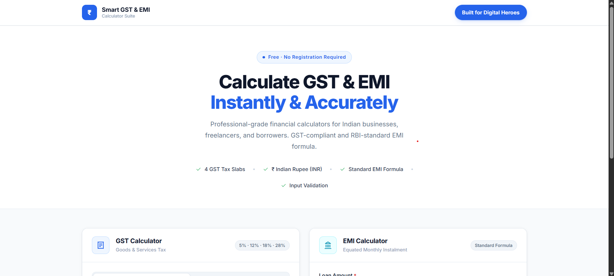
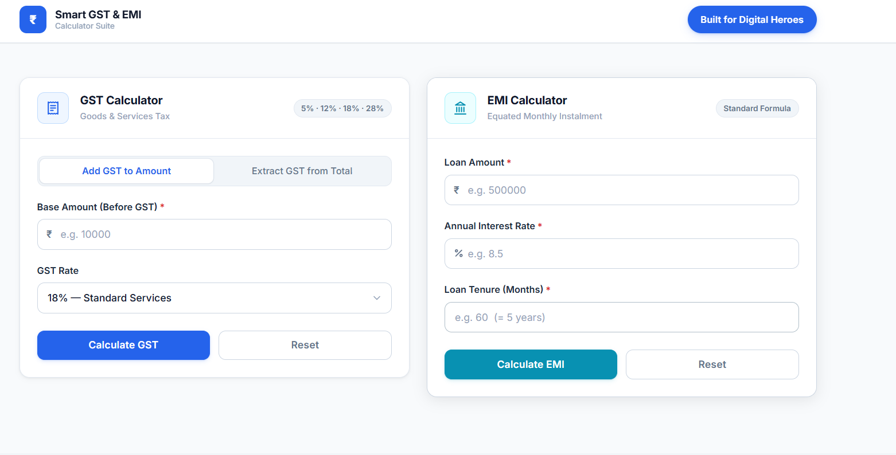

# Smart GST & EMI Calculator

A modern and responsive financial calculator built using React and Vite that helps users calculate GST and EMI instantly with a clean and professional interface.

## Live Demo

🔗 https://smart-gst-emi-calculator.vercel.app

## GitHub Repository

🔗 https://github.com/harsh-dsk/smart-gst-emi-calculator

---

## Features

### GST Calculator

- Calculate GST amount on a base value
- GST slabs: 5%, 12%, 18%, 28%
- Calculate final amount after GST
- Extract base amount from GST-inclusive values
- Real-time calculations and validation

### EMI Calculator

- Calculate monthly EMI
- Calculate total interest payable
- Calculate total repayment amount
- Supports custom loan amount, interest rate, and tenure
- Indian Rupee (₹) formatting

### User Experience

- Responsive design
- Mobile-friendly interface
- Professional UI
- Input validation
- Fast calculations
- Clean card-based layout

---

## Screenshots

### Home Page



### Calculator Section



---

## Tech Stack

- React.js
- Vite
- JavaScript (ES6+)
- CSS3
- React Hooks

---

## Installation

Clone the repository:

```bash
git clone https://github.com/harsh-dsk/smart-gst-emi-calculator.git
```

Navigate to the project folder:

```bash
cd smart-gst-emi-calculator
```

Install dependencies:

```bash
npm install
```

Run locally:

```bash
npm run dev
```

Build for production:

```bash
npm run build
```

---

## Project Structure

```text
src/
├── components/
│   ├── GSTCalculator.jsx
│   └── EMICalculator.jsx
│
├── hooks/
│   ├── useGSTCalculator.js
│   └── useEMICalculator.js
│
├── utils/
│   └── calculators.js
│
├── App.jsx
├── main.jsx
└── index.css
```

---

## Assignment Requirements Completed

- GST Calculator
- EMI Calculator
- Responsive Design
- Indian Rupee Currency Support
- Input Validation
- Professional UI
- Public GitHub Repository
- Vercel Deployment
- Built for Digital Heroes Button
- Developer Information Displayed

---

## Developer

**Harshdeep Singh Khanuja**

📧 harshdeepsingh.khanuja0102@gmail.com

🔗 GitHub: https://github.com/harsh-dsk

🔗 LinkedIn: https://www.linkedin.com/in/harsh-dsk/

---

## Deployment

Hosted on Vercel:

https://smart-gst-emi-calculator.vercel.app

---

## License

This project was created for educational and internship assessment purposes.
